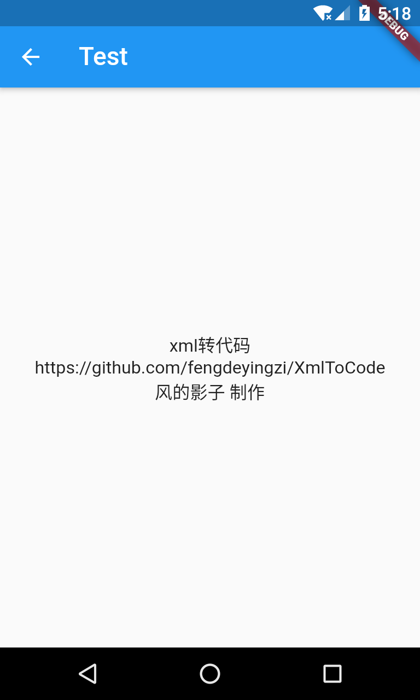

# xmlflutter

高度模拟安卓布局结构，将安卓xml布局转换为flutter布局


简单使用：

#### 安卓xml布局

```xml
<?xml version="1.0" encoding="utf-8"?>
<LinearLayout xmlns:android="http://schemas.android.com/apk/res/android"
    android:orientation="vertical" android:layout_width="match_parent"
    android:gravity="center"
    android:layout_height="match_parent">

    <TextView
        android:layout_width="match_parent"
        android:layout_height="wrap_content"
        android:textSize="18sp"
        android:gravity="center"
        android:text="xml转代码\nhttps://github.com/fengdeyingzi/XmlToCode"
        android:autoLink="web"
        android:padding="32dp"
        />
    <TextView
        android:layout_width="wrap_content"
        android:layout_height="wrap_content"
        android:textSize="16sp"
        android:text="风的影子 制作"
        />

</LinearLayout>
```

#### 转换为Flutter布局

```dart
LayoutOrientation(
        orientation: LinearLayout.VERTICAL,
        child: LinearLayout(
          layout_width:MATCH_PARENT,
          layout_height:MATCH_PARENT,
          orientation:LinearLayout.VERTICAL,

          children:[
            Button(
              layout_width: MATCH_PARENT,
              layout_height: WRAP_CONTENT,
              text: "Test Android Layout",
              onPressed: (){
                navigationTo(TestWidget());
              },
            ),
            Button(
              layout_width: MATCH_PARENT,
              layout_height: WRAP_CONTENT,
              text: "FrameLayout",
              onPressed: (){
                navigationTo(FrameWidget());
              },
            ),
            Button(
              layout_width: MATCH_PARENT,
              layout_height: WRAP_CONTENT,
              text: "ImCardWidget",
            onPressed: (){
              navigationTo(ImCardWidget());
            },),
            Button(
              layout_width: MATCH_PARENT,
              layout_height: WRAP_CONTENT,
              text: "CappError",
            onPressed: (){
              navigationTo(CAPPErrorWidget());
            },),
            Button(
              layout_width: MATCH_PARENT,
              layout_height: WRAP_CONTENT,
              text: "CAPP Hello",
              onPressed: (){
                navigationTo(CappViewpager4Widget());
              },),
          ],
        ),
      ),
```

#### 效果展示




#### 目前支持以下属性

* layout_width
* layout_height
* gravity
* layout_gravity(不完整兼容)
* orientation
* paddingLeft paddingTop paddingRight paddingBottom
* marginLeft marginTop marginRight marginBottom
* textColor
* textSize
* ...


以后会慢慢完善功能，欢迎关注~


#### 相关推荐

xml代码转flutter及swift/java：https://github.com/fengdeyingzi/XmlToCode


## Getting Started

This project is a starting point for a Flutter application.

A few resources to get you started if this is your first Flutter project:

- [Lab: Write your first Flutter app](https://flutter.dev/docs/get-started/codelab)
- [Cookbook: Useful Flutter samples](https://flutter.dev/docs/cookbook)

For help getting started with Flutter, view our
[online documentation](https://flutter.dev/docs), which offers tutorials,
samples, guidance on mobile development, and a full API reference.
